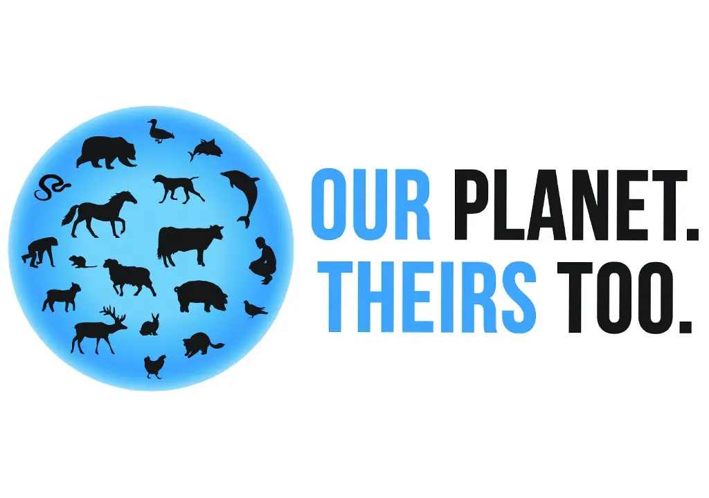

  
   

  #  💆🏼‍♀️ Home For All  

<!-- TABLE OF CONTENTS -->

# 📗 Table of Contents

- [📖 About the Project](#about-project)
  - [🛠 Built With](#built-with)
    - [Tech Stack](#tech-stack)
    - [Key Features](#key-features)
  - [🚀 Live Demo](#live-demo)
- [💻 Getting Started](#getting-started)
  - [Setup](#setup)
  - [Prerequisites](#prerequisites)
  - [Install](#install)
  - [Usage](#usage)
  - [Run tests](#run-tests)
  - [Deployment](#triangular_flag_on_post-deployment)
- [👥 Authors](#authors)
- [🔭 Future Features](#future-features)
- [🤝 Contributing](#contributing)
- [⭐️ Show your support](#support)
- [🙏 Acknowledgements](#acknowledgements)
- [❓ FAQ](#faq)
- [📝 License](#license)

<!-- PROJECT DESCRIPTION -->

## 🛠 Built With 

### Tech Stack 

<!-- Features -->

### Key Features 

> Describe between 1-3 key features of the application.

- **[Totally responsive website]**
- **[Mobile menu implemented with JD]**
- **[Home and about pages linked between them]**

(<a href="#readme-top">back to top</a>)

<!-- LIVE DEMO -->

## 🚀 Live Demo 

> Here you can see the live demo of the website:

- [Live Demo Link](https://rivasbolinga.github.io/Home-For-All)

(<a href="#readme-top">back to top</a>)

<!-- GETTING STARTED -->

## 💻 Getting Started 

To get a local copy up and running, follow these steps.

### Prerequisites

In order to run this project you need:

 -A PC running any operating system like Windows, Linux, or MacOS.
 
 -An Internet connection.
 
 -A browser like Google Chrome or Mozilla Firefox.
 
 -Git installed
 
 -Knowledge of some basic Git commands

### Setup

Clone this repository to your desired folder:

 1.Clone this repository to your desired folder:
 

 2.run: git clone git@github.com:rivasbolinga/Portfolio.git
 
 2.Open the file in your code editor
 

(<a href="#readme-top">back to top</a>)

<!-- AUTHORS -->

## 👥 Authors 

👤 **Andrea Rivas Palacios**

- GitHub: [@rivasbolinga](https://github.com/rivasbolinga)
- Twitter: [@AndreaRivasPal](https://twitter.com/AndreaRivasPal)

(<a href="#readme-top">back to top</a>)

<!-- CONTRIBUTING -->

## 🤝 Contributing 

Contributions, issues, and feature requests are welcome!

Feel free to check the [issues page](../../issues/).

(<a href="#readme-top">back to top</a>)

<!-- SUPPORT -->

## ⭐️ Show your support 

> Write a message to encourage readers to support your project

If you like this project...

(<a href="#readme-top">back to top</a>)

<!-- ACKNOWLEDGEMENTS -->

## 🙏 Acknowledgments 

> Original design idea by Cindy Shin in Behance. behance.net/adagio07 
>
>Background picture on the introduction section from:
Photo by <a href="https://unsplash.com/@derstudi?utm_source=unsplash&utm_medium=referral&utm_content=creditCopyText">Timon Studler</a> on <a href="https://unsplash.com/photos/ABGaVhJxwDQ?utm_source=unsplash&utm_medium=referral&utm_content=creditCopyText">Unsplash</a>
  

(<a href="#readme-top">back to top</a>)

<!-- LICENSE -->

## 📝 License 

This project is [MIT](https://github.com/rivasbolinga/Home-For-All/blob/first-features/MIT.md) licensed.

(<a href="#readme-top">back to top</a>)

